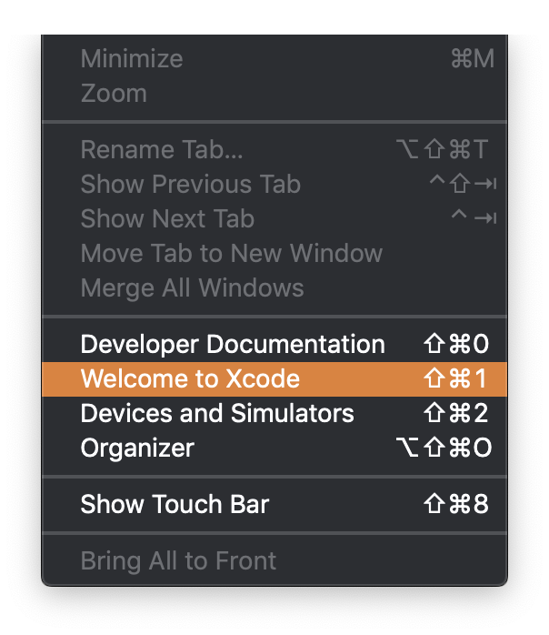
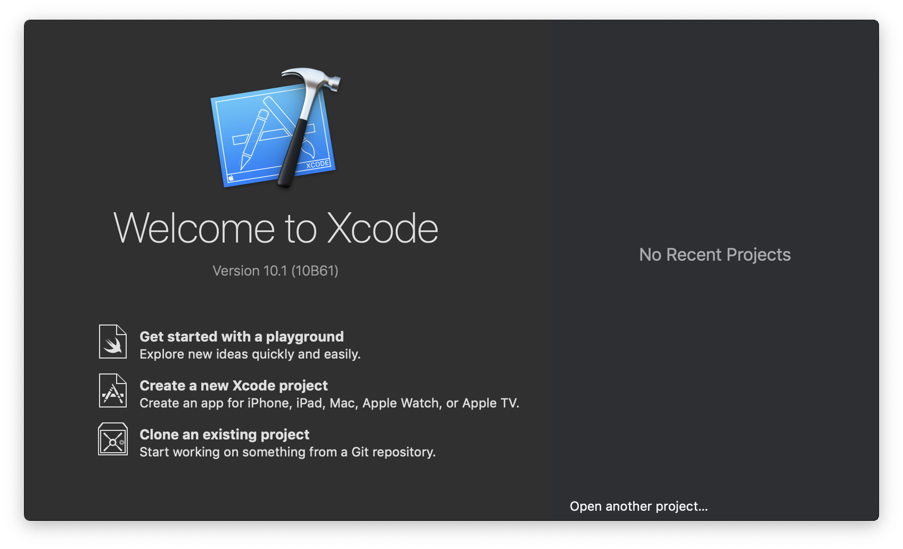

# QE-Challenge
## Code challenge for QA Automation Engineer

Please write tests around the following app.

In this app, you can log in under either of these credentials to begin a game:
  - Username: Austin, Password: super_secret_password
  - Username: Pooja, Password: test_password1
  
You can tap the `+` and `-` buttons to increment and decrement the score. 
Once you reach a score of 10, a screen appears indicating that you won, and your score begins again at 0.

Additional notes:
  - A negative score is not possible
  - Your login status is saved through app close + reopen
  - Your current score is saved through app close + reopen
  - Upon logging out or app uninstall, your score is cleared

## Running the app

1. Download the latest version of Xcode from the App Store

1. From the `Window` tab, select `Welcome to Xcode`

1. Click on `Clone an existing project`

1. For `Enter repository URL`, enter https://github.com/joor/QE-Challenge and hit `clone`

1. Save the repository somewhere and Xcode will open up the project

1. Make sure that you have the scheme and target selected like so:

1. Click the Run button and Xcode will build and run the app. 
When the build is finished, Xcode will launch a simulator and the app will begin running

